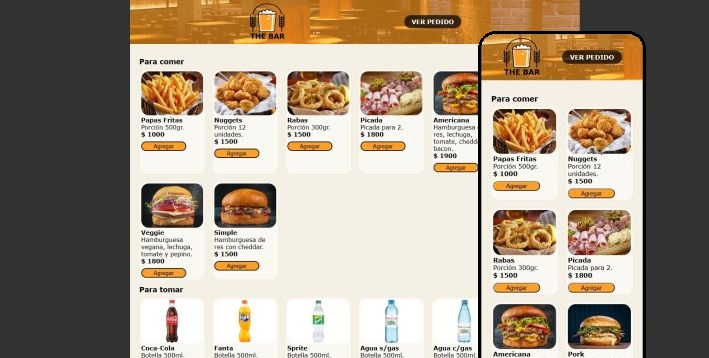
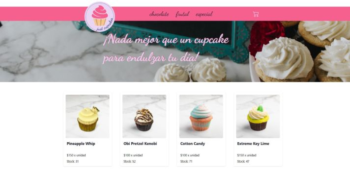

# ¡Hola! 👋 Soy María Soledad Higa

## Front-end developer

Disfruto los desafíos y crear cosas. Tengo una curiosidad que me lleva a estar aprendiendo constantemente.

   

 Contactame  

### Proyectos

<table style="border:none">
<tr style="border:none;background-color:none">
 <td style="border:none;background-color:none" width="60%"></td>
   <td align="center" style="border:none;background-color:none">
    The Bar
      
    Características: - Html, CSS y Vanilla Javascript  - Responsive, Mobile first
      
    <a href="https://entrega-final-js-coderhouse.netlify.app/">Link al proyecto</a> <a href="https://github.com/MariaSoledadHiga/javascript-entrega-final">Link al repositorio</a>
  </td>
</tr>
<tr style="border:none;background-color:none">
 <td style="border:none;background-color:none" width="60%"></td>

  <td align="center" style="border:none;background-color:none">
    Just Cupcakes
      
    Características: - React JS web App  - Firebase
      
    <a href="https://entrega-final-react-js-coderhouse.netlify.app/">Link al proyecto</a> <a href="https://github.com/MariaSoledadHiga/react-js-entrega-final">Link al repositorio</a>
  </td>
</tr>
</table>

